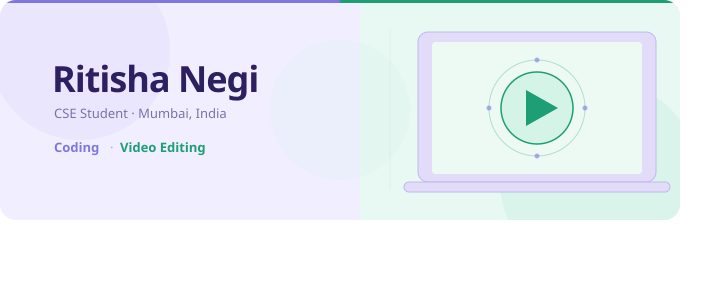

# 💫About Me:

Hi, I'm Ritisha Negi — a student studying Computer Science and Engineering in Mumbai. I'm passionate about technology and love building projects that solve real problems. I enjoy working with different people and I'm always looking to grow and learn something new every day. When I'm not coding, I'm editing videos. I created this space to document my journey, share my projects, and connect with people who love tech just as much as I do. Whether you're here to collaborate, give feedback, or just explore — welcome, and feel free to reach out!

## 🌐Socials:
 

# 💻Skills:
         

